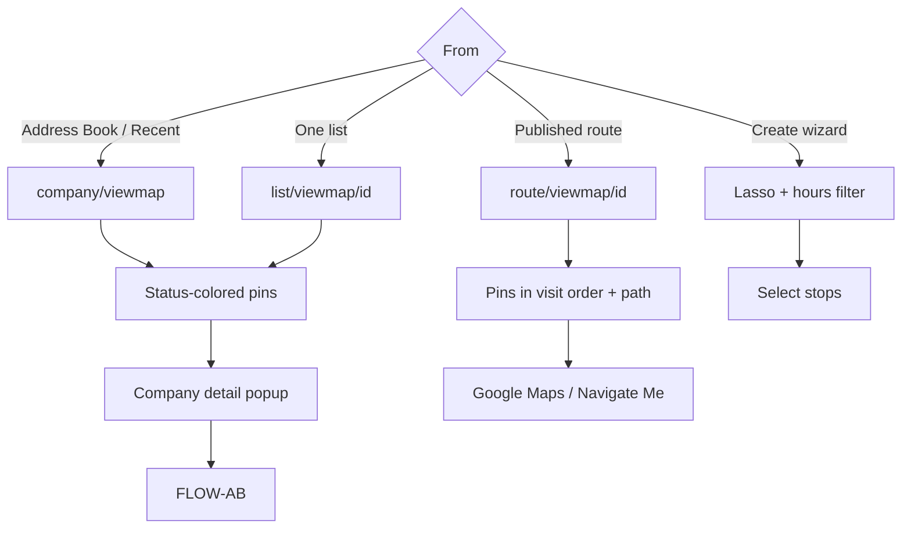

# Maps — flows

Part of [11-Maps](MODULE.md). Use cases: [use-cases.md](use-cases.md). Shared view: `front.company.viewmap`.

## FLOW-MAPS

```mermaid
flowchart TD
  Src{From}
  Src -->|Address Book / Recent| All[company/viewmap]
  Src -->|One list| List[list/viewmap/id]
  Src -->|Published route| Rte[route/viewmap/id]
  Src -->|Create wizard| Build[Lasso + hours filter]
  All --> Pins[Status-colored pins]
  List --> Pins
  Rte --> Order[Pins in visit order + path]
  Build --> Pick[Select stops]
  Pins --> Open[Company detail popup]
  Order --> Nav[Google Maps / Navigate Me]
  Open --> FLOWAB[FLOW-AB]
```
