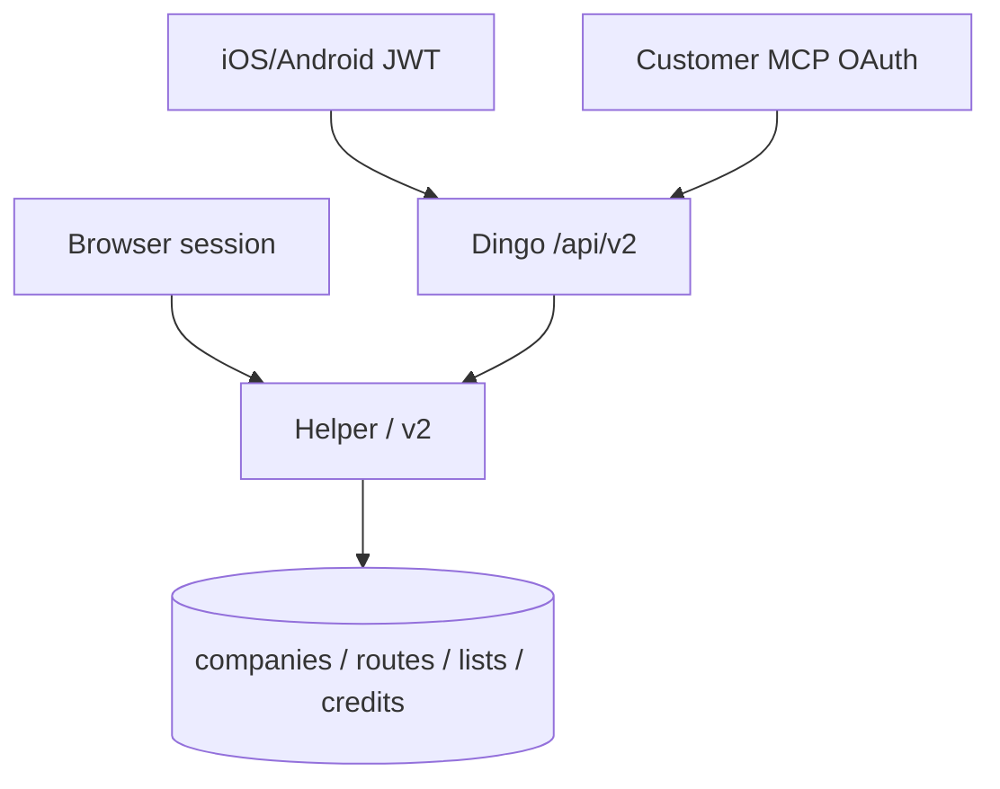

# Clients — flows

Part of [18-Clients](MODULE.md). Not a user-click journey. Surfaces converge on Helper / v2.

```mermaid
flowchart TD
  Web[Browser session] --> Helper[Helper / v2]
  Mob[iOS/Android JWT] --> V2[Dingo /api/v2]
  MCP[Customer MCP OAuth] --> V2
  V2 --> Helper
  Helper --> DB[(companies / routes / lists / credits)]
```
