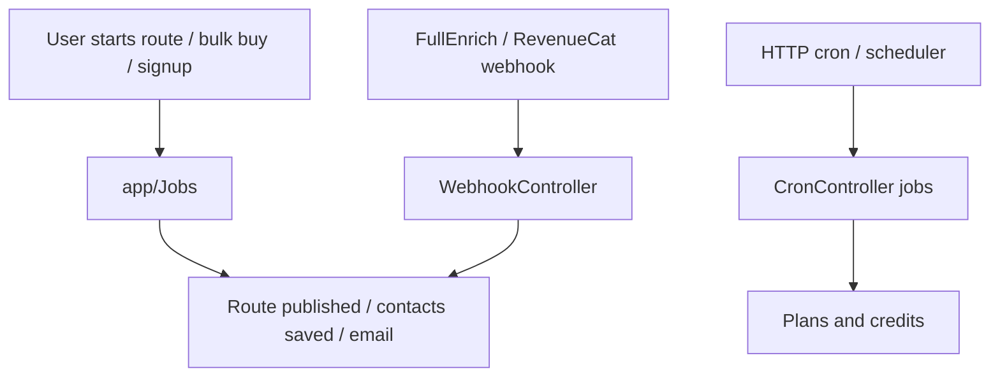

# Cron / webhooks — flows

Part of [19-Cron-Jobs-Webhooks](MODULE.md). Use cases: [use-cases.md](use-cases.md).

```mermaid
flowchart TD
  Click[User starts route / bulk buy / signup]
  Click --> Queue[app/Jobs]
  Timer[HTTP cron / scheduler] --> Jobs[CronController jobs]
  Provider[FullEnrich / RevenueCat webhook] --> Hook[WebhookController]
  Queue --> Side[Route published / contacts saved / email]
  Jobs --> Credits[Plans and credits]
  Hook --> Side
```
