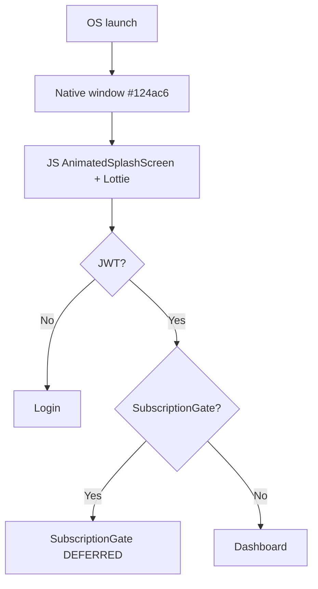

# App launch

```mermaid
flowchart TD
  A[OS launch] --> B[Native window #124ac6]
  B --> C[JS AnimatedSplashScreen + Lottie]
  C --> D{JWT?}
  D -->|No| E[Login]
  D -->|Yes| F{SubscriptionGate?}
  F -->|Yes| G[SubscriptionGate DEFERRED]
  F -->|No| H[Dashboard]
```

Splash stills were not provided. Minimum JS splash duration is ~3s in code.

**Needs Manual Verification:** exact splash animation vs native launch image.
